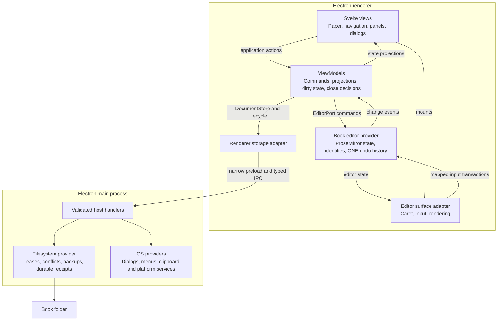
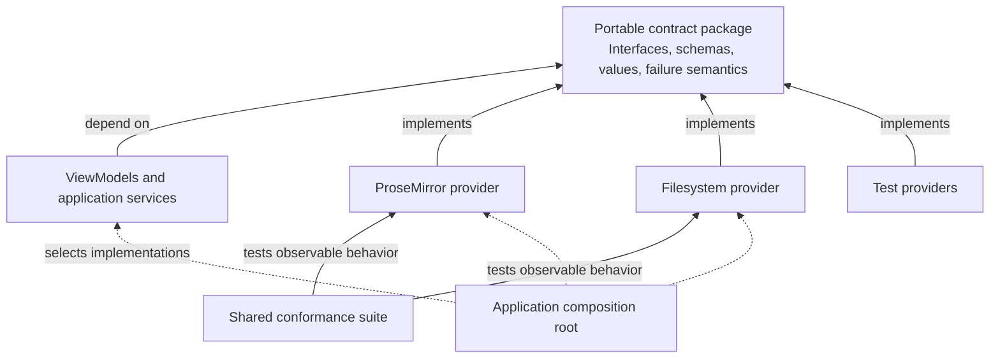
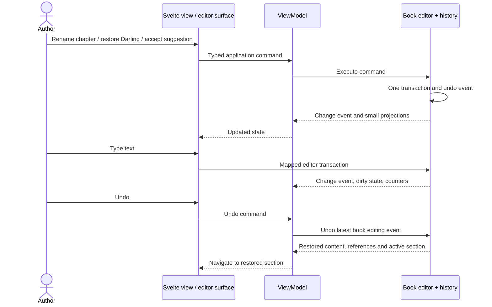
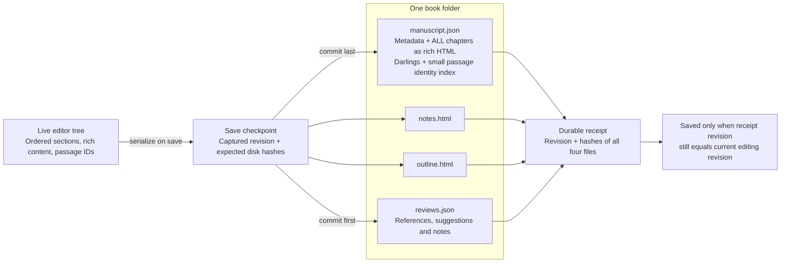
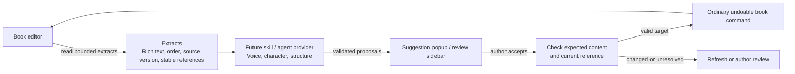

# Architecture for sign-off

The proposal is a standalone Svelte/TypeScript Electron application, following Drawloom's contract conventions. ProseMirror owns editing; MVVM owns application state and commands; Electron main owns storage and OS access. NEO's author experience remains the feature acceptance standard.

These diagrams describe the proposed production boundaries. The composition spike implements representative paths through them. Full package extraction, NEO feature migration and agent execution remain implementation work.

## 1. Runtime ownership

Views display state and invoke commands. ViewModels coordinate behavior. The editor adapter handles the caret and input without turning every keystroke into a whole-book Svelte update. Main is the only process with filesystem access. OS provider boxes describe the production direction; the composition spike proves storage and lifecycle.

## 2. Contracts and replaceable providers

Each capability has its own contract. This diagram abbreviates the repeated pattern; it does not propose one universal interface. Contracts never import provider SDKs. The composition root connects actual implementations. The spike runs shared storage conformance against filesystem and memory providers; expanding editor and host conformance belongs to package extraction.

| Contract | What the caller can rely on |
| --- | --- |
| `EditorPort` | Typed authoring commands, projections, change events, references and global undo/redo; no ProseMirror objects |
| `SurfacePort` | Mount, update, focus and destroy the visible editors |
| `DocumentStore` | Open documents; save a checkpoint against expected hashes; receive the acknowledged revision and new hashes |
| `AuthoringLifecycle` | Read-only state, dirty notification, close requests and completion |
| Host envelopes | Fixed methods, validated payloads and replies, lease and session checks |
| Review values | Bounded extracts in; standard suggestions or notes out; anchored to expected content |

A contract specifies behavior as well as shape. For example, a stale storage hash must refuse an overwrite, and accepting a stale suggestion must leave the newer prose intact. Zod validates boundary values; shared conformance suites verify those observable guarantees. This follows [Drawloom ADR 0004](/Users/afifim/Development/drawloom/docs/adr/0004-standardise-capability-contracts.md).

## 3. Commands, typing and undo

One history owns prose, chapters, notes, outline, Darling records and accepted suggestion state. Review attachment and dismissal are separate persisted review state. Reopening begins a new editing history.

NEO's double/triple Enter, scene boundaries, poetry and structural undo grouping must become public editor plugins and typed commands. ProseMirror supplies transactions and history; NEO supplies the behavior. The spike's generic keymap is not the final authoring behavior.

## 4. Memory, files and saving

The folder stays flat. Chapters live together in one manuscript document. HTML is the compatibility representation inside the envelope; the passage index provides stable identity for reopening and reviews. The research model stays separate. Existing assets and metadata must survive migration.

Writing stays in memory. Serialization occurs on save. Each file is replaced durably with a validated backup; manuscript commits last. The complete receipt acknowledges all four files.

This is not a single atomic folder transaction. If saving is interrupted, notes, outline or reviews can be newer than prose. A review/book version mismatch becomes unresolved, so its suggestion cannot silently edit the wrong text. A whole-folder atomic guarantee would require additional commit machinery. Choose this recovery policy explicitly before implementing production storage.

## 5. Research and future agents

The manuscript remains the source of truth. Research can assemble character arcs or voice samples from extracts and return a common review format. Local Codex/Claude providers, independent threads, plugin permissions and sidebar hierarchy are later design work. The current proof uses deterministic replies.

## What approval would mean

| Decision | Recommendation |
| --- | --- |
| Application boundaries | Standalone Svelte/TypeScript/MVVM Electron app, portable contracts and provider selection at composition roots |
| Editing ownership | ProseMirror master state and one book-level history; NEO behavior implemented explicitly |
| Document direction | One manuscript envelope with compatible rich HTML and passage IDs; separate auxiliaries |
| Recovery policy | Independently durable files and complete receipts, with explicit partial-save recovery |
| Research direction | Derived extracts and standard anchored proposals; agent execution deferred |
| Fidelity gate | Carry every NEO feature into migration acceptance before retiring its old implementation |

Approval establishes these boundaries and priorities. Final review UX, complete NEO fidelity, platform behavior and production recovery details are judged through implementation acceptance. The retained migration ledger covers 304 features and 444 registered desktop scenarios. [REGROUP.md](REGROUP.md) records the fresh spike evidence and rewrite sequence.
